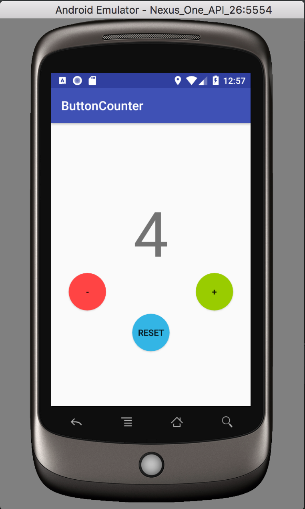

# Button-Counter-Ramos  
# README  
## Instructions:
Create an app that has three buttons, one for incrementing a counter, one for decrementing the counter, and one for resetting the counter to 0. The counter must be displayed as a TextView and must retain its state when the phone is rotated between portrait and landscape modes. There should be no values, such as strings, dimensions, etc. hardcoded in the .java files. They should be maintained and accessed from the appropriate resource files.

## Wow Factors:
1. The size of the count has been increased.  
2. The three buttons have been filled with color.  
3. The three buttons have circular shapes.  

## Reference(s):
1. Circular Buttons: https://stackoverflow.com/questions/9884202/custom-circle-button (User: Adil Soomro)   

  

